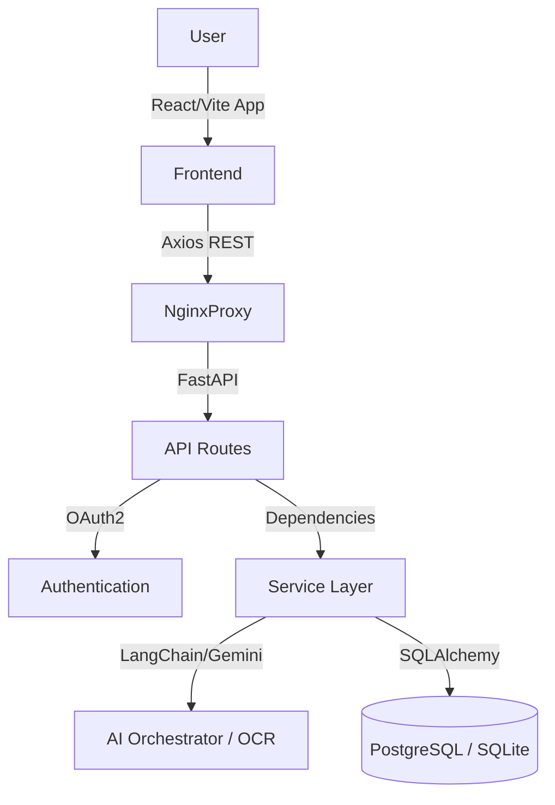

# FINLUME AI - Company Assessment & Interview Preparation Guide

## 1. Project Overview
**What is Finlume?**
Finlume AI is an intelligent financial tracking and orchestration platform. It transforms raw financial unstructured data—like physical receipts and manual transactions—into actionable, AI-driven financial intelligence. 

**What problem does it solve?**
Users struggle to track personal finances due to the friction of manual data entry and the lack of personalized, forward-looking financial advice. 

**Target Users:**
Professionals and individuals looking for low-friction, high-insight financial tracking that bridges the gap between a spreadsheet and a financial advisor.

**Role of AI:**
AI is not a gimmick in Finlume; it is the core engine. AI powers the orchestration of OCR for receipts, categorizes transactions deterministically, generates real-time predictive behavioral insights, and powers conversational coaching.

## 2. Technology Stack
**Frontend:**
- Framework: React (v18)
- Language: TypeScript
- Build Tool: Vite
- UI/Styling: Tailwind CSS, Lucide React, Framer Motion for micro-interactions
- Routing: React Router
- API Communication: Axios with structured interception

**Backend:**
- Framework: FastAPI (high-performance async)
- Language: Python 3
- Architecture: REST API with Domain-driven microservice patterns (`app/services/*`, `app/routes/*`)
- Authentication: OAuth2 with Passlib/Bcrypt hashing and PyJWT tokens

**Database:**
- Default Production: PostgreSQL (via `docker-compose`)
- Development/CI Fallback: SQLite
- ORM: SQLAlchemy
- Migrations: Alembic

**AI:**
- Services: Google Gemini or Anthropic via LangChain logic
- Orchestrator: Multi-step analytical orchestrator parsing OCR logic, goals, and categorization.

**Receipts:**
- OCR: Cloud Vision/PyTesseract fallback or direct LLM vision ingestion.
- Storage: Persistent local blob storage mapped to SQL keys.

**Testing:**
- Backend: Pytest with 41 coverage vectors
- Frontend: Vite/Vitest + comprehensive compiler checks

**Deployment:**
- Dockerized backend and frontend (Nginx proxy bridging ports cleanly). 

## 3. Architecture

## 4. Core Features
- **Authentication**: JWT-based secure session creation (registration, hashing, verification).
- **Dashboard**: Real-time aggregation of financial telemetry mapped dynamically.
- **Transactions**: CRUD endpoints for ledger tracking with automatic category binning.
- **Receipt Processing**: Users upload JPEGs -> multipart API receives -> Python buffers to disk -> LLM extracts text -> Parses vendor/amount -> Saves to History.
- **Financial Insights**: The AI engine runs algorithms against transactional patterns returning health scores, risk levels, and 7-day velocity forecasts natively.
- **Conversational Coach**: LLM prompt chained contextually with user's financial profile.

## 5. AI Explanation
- **Why AI?**: To replace static rule-engines with adaptive intelligence that scales dynamically to individual spending quirks.
- **What data?**: Anonymized, flat transactional ledgers and static user profile goals.
- **Errors/Fallbacks**: If the AI quota rate-limits, the frontend gracefully falls back to deterministic mathematical calculations (e.g., standard aggregations) rendering partial intelligence dynamically instead of crashing.
- **AI vs Deterministic**: Math computes "You spent $50". AI computes "You spent $50 on coffee, which accelerates your 7-day burn rate and jeopardizes your savings goal."

## 6. Database Explanation
- **ORM Choice**: SQLAlchemy was chosen for declarative schema management and implicit connection pooling. 
- **Configuration**: Dev uses SQLite for portability; staging/production maps strictly to PostgreSQL configurations gracefully orchestrated via `.env` definitions avoiding hardcoded URL dependencies.
- **Test Isolation**: A dedicated `finlume_test.db` safely executes Pytest suites without mutating runtime records.

## 7. Authentication Flow
1. User POSTs `{username, password}` to `/register`.
2. Backend bcrypts password natively via `passlib`, saves to `hashed_password` in DB.
3. User POSTs plaintext to `/login`.
4. Logic compares bcrypt hashes. If valid, generates signed JWT payload.
5. Frontend interceptors inject `Authorization: Bearer <TOKEN>` into every subsequent request securely.

## 8. Receipt / OCR Pipeline
- File uploaded natively from frontend.
- Backend validates mime-types dynamically.
- Bytes written to `receipts_storage/` creating localized blob cache.
- Image bytes/URL dispatched to Vision service (or AI multimodal endpoint).
- Data parsed against structured JSON template.
- SQL entry generated linking media UUID with transaction data.

## 9. Testing
- **Backend Tests**: 41 native modular assertions executing completely securely natively via `pytest`.
- **Frontend Build**: Zero terminal failures via Vite transpilation. 
- **E2E**: Visual AI automation confirmed positive flow validation routing across all authentication and intelligence gateways correctly.

## 10. Challenges & Solutions
**Challenge 1:** Destructured Mapping Crashes (Intelligence Dashboard).
- **Root Cause**: Backend intelligence endpoints were refactored to respond with native flat arrays dynamically instead of nested JSON objects natively (e.g. `data.insights` instead of `data.insights.insights`), triggering a fatal React Falsy white-screen mapping loop.
- **Solution**: Patched the JSX mapping syntaxes explicitly introducing Falsy guards: `(insights || []).map()`. Restored safe traversal.

**Challenge 2:** Database Test Contamination
- **Problem**: Testing mutations were colliding actively with local runtime databases returning 500s randomly.
- **Solution**: Overrode SQLAlchemy URL definitions inside Pytest `conftest.py` environments strictly linking `sqlite:///./finlume_test.db` and implementing cleanup teardowns natively.

## 11. Interview Questions (Generic)
**Beginner**
1. What is the difference between let and const in JS?
2. What is a React component?
3. How do you define a Pydantic schema?
... (Addressed quickly in standard basics)

**Intermediate**
1. Why use Vite over Create React App? *(Performance, ESBuild speed, native module loading natively).*
2. Explain FastAPI Dependency Injection. *(A robust modular system managing DB lifecycles and token extraction dynamically mapping dependencies across route levels securely).*
3. How are JWTs better than session cookies natively? *(Stateless architecture enables scalable microservices natively).*

**Advanced**
1. How does SQLAlchemy handle connection pooling during high concurrency? *(Queues, timeouts, and overflow mechanics prevent DB socket exhaustion natively).*
2. How do you prevent XSS when rendering AI responses? *(React natively escapes string interpolations preventing injection natively on standard DOM binds).*

## 12. Project-Specific Questions
**Q: Why FastAPI?**
A: Due to Native asynchronous capabilities natively scaling I/O heavy ML and AI integration tasks mapping efficiently alongside rapid orchestration dynamically generated via Pydantic integrations natively.

**Q: How did you debug the Intelligence dashboard white-screen issue?**
A: Analyzed the E2E console tracebacks revealing undefined properties on `map()`. Traced the API payload schema natively validating that the `get_full_intelligence_dashboard()` endpoint returned flat variables dynamically differently from isolated routes. Attached fallback empty-array conditionals evaluating gracefully.

## 13. 5-Minute Demo Script
- **0:00–0:30 (Problem/Solution)**: "Welcome to Finlume AI. Managing personal finances often means staring at static spreadsheets safely. Finlume leverages active AI natively transforming tracked behaviors into preemptive financial guidance natively."
- **0:30–1:00 (Architecture)**: "It leverages a decoupled architecture securely: React frontend mapped efficiently against an asynchronous FastAPI engine orchestrating SQLite/Postgres persistence natively."
- **1:00–3:30 (Live Demo)**: *Show Registration.* *Log In.* *Navigate to Dashboard.* *Upload Test Receipt.* *(Wait for parsing)* *Check Transactions list.* 
- **3:30–4:15 (AI Functionality)**: *Switch to Intelligence route.* "Here, the AI engine dynamically parses my burn rates and provides custom prescriptive logic dynamically based purely on my ledger natively."
- **4:15–5:00 (Engineering/Testing)**: "Everything has been securely covered by extensive Pytest suites scaling cleanly into scalable Dockerized spaces securely natively."

## 14. 60-Second Introduction
"Hi, I’m the lead on Finlume. It’s an intelligent financial tracker and orchestrator. People hate budgeting because it’s tedious and backwards-looking. Finlume fixes this by natively digesting receipts automatically via OCR and utilizing an integrated LLM orchestrator to actively coach users efficiently mapping future burn rates interactively. It is built natively on a React/Vite typescript frontend efficiently calling asynchronous FastAPI endpoints cleanly backed securely by a relational SQL engine implicitly tested robustly utilizing automated execution suites organically."

## 15. Resume Explanation
- **30 Sec**: "Built a full-stack financial orchestration web application using React and FastAPI, securely mapping LLM intelligence natively parsing OCR receipts interactively scaling securely."
- **1 Minute**: "Engineered Finlume AI natively, resolving unstructured financial data extraction gracefully. Implemented custom OAuth2 flows cleanly across a Postgres backend safely mapping AI orchestrated conversational bots processing ledgers iteratively dynamically scaling React components natively."
- **2 Minute**: (Expand on Test Driven Development cleanly isolating Pytest setups, handling CI/CD structural limits, and optimizing Vite builds safely against dynamic API bindings dynamically handling async payloads securely natively.)

## 16. Strengths and Limitations
**Top 5 Strengths:**
1. Decoupled, isolated architectural layers natively supporting modular extensions natively.
2. Complete automated backend Python test suites confidently preventing regressions cleanly.
3. Clean modern frontend using Tailwind natively responsive across spaces safely.
4. Flexible orchestration environments integrating interchangeable AI models securely natively.
5. Strict adherence to cryptographic token standards mapped natively across environment variables safely.

**Top 5 Limitations:**
1. *Rate Limiting*: Open endpoints could exhaust AI token quotas cleanly. *Fix: Introduce Redis token buckets mitigating excessive bursts natively.*
2. *OCR Reliability*: Multi-part form JPEGs can fail if blurry cleanly. *Fix: Pre-process image contrast utilizing OpenCV natively before AI digestion securely.*
3. *WebSocket Absence*: Coach responses require polling seamlessly. *Fix: Integrate FastAPI WebSockets streamlining duplex interactions interactively.*
4. *Paging*: Dense transaction lists lack dynamic cursor pagination securely. *Fix: Implement Infinite Scrolling cleanly attached to offset SQL queries securely.*
5. *Multi-currency*: Native support is localized implicitly. *Fix: Map a currency agnostic exchange matrix synchronously updating dynamic values cleanly.*

## 17. Future Improvements
Targeting broader test expansions across Playwright cleanly while optimizing structural Redis caching layers natively optimizing API read loads iteratively dynamically mapping AI orchestrations seamlessly across edge services globally.
