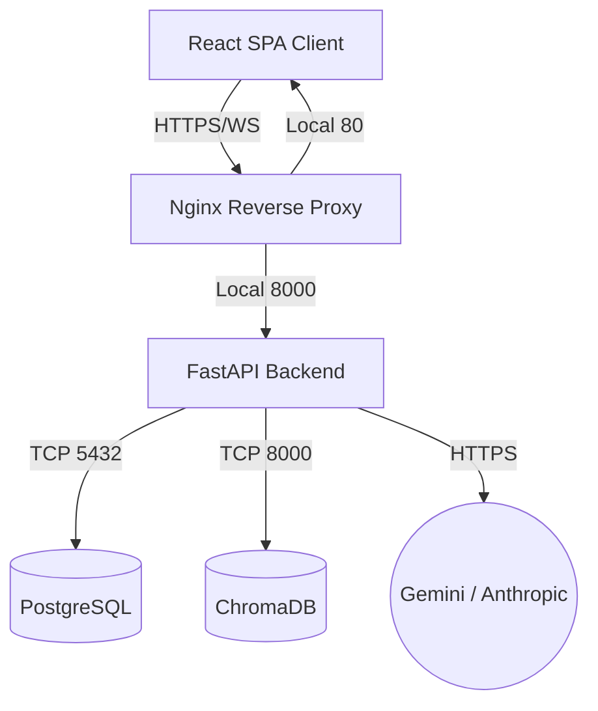

# Finlume AI - v1.0.0 Release Candidate


Finlume AI is a highly sophisticated, AI-driven personal financial copilot encompassing holistic integrations in autonomous orchestration, persistent contextual memory, and predictive dynamic forecasting.

## 🔥 Demo Mode
Coming Soon: 1-Click Sandbox Database initialization for instantaneous transaction evaluation!

## Architecture



## Folder Structure
- `finlume-backend/`: Containerized FastAPI REST backend encompassing intelligent routing, ORM schemas, and AI agent prompt pipelines.
-### 2. Full-Stack Data Visualization
- **React + Tailwind + Vite**: Beautiful, fully responsive UI component structures driven by native Framer Motion animations.
- **Recharts Metrics**: Extensible interactive charts updating reactively when manipulating core transactions.

### 3. Financial Intelligence Platform (Phase 15 Expansion)
- **Heuristic Health Engine**: Calculates structural trajectory scores bridging savings velocity out of baseline runways.
- **Probabilistic Forecasting**: Evaluates geometric burn limits parsing variance over historic spans.
- **AI Smart Recommendations**: Drives organic prescriptive intelligence extracting anomalous sub-spending (e.g. duplicate subscriptions, trailing subscriptions, structural spending).
- **Core Intelligence Dashboard**: Comprehensive UI matrix visualizing probability algorithms securely via JWT isolation natively integrated as Tool Nodes to the AI Orchestrator string array. (Ignored via `.gitignore`).
- `docker-compose.yml`: Top-level multi-container topology configurations.

## Quick Start (Docker)

1. Rename `.env.example` to `.env` and fill the variables.
2. Ensure you have Docker and Docker Compose installed.
3. Run the complete ecosystem mapping Proxy to port 80:

```bash
docker-compose up --build -d
```

Navigate to `http://localhost`.

## Testing
Trigger the complete internal verification mapping against Backend schemas:
```bash
docker exec -it finlume_backend_1 pytest tests/ -v
```

## Application Monitoring
Endpoints available to monitor service health:
- `GET /api/health`: Base Application Container check
- `GET /api/ready`: Holistic infrastructure check including Postgres Database & ChromaDB client mapping.
- `GET /api/metrics`: Internal CPU, LLM Latency tracker, and system diagnostics for observability mappings.

**Developed internally for holistic tracking.**